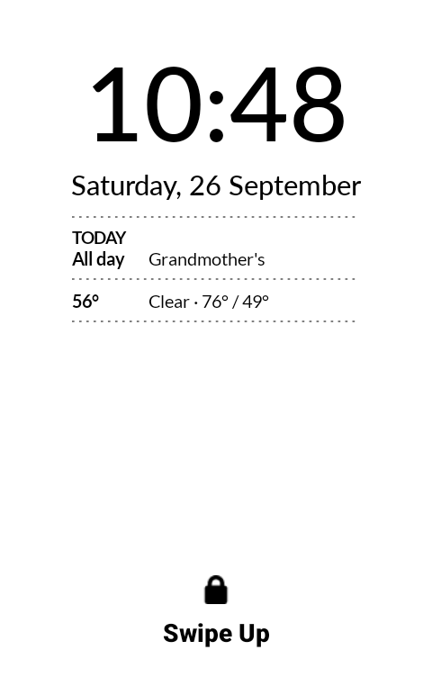
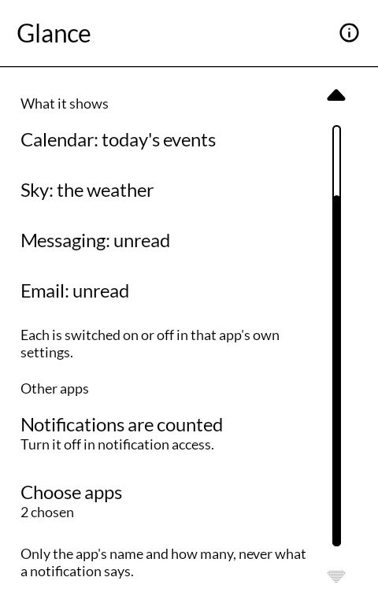
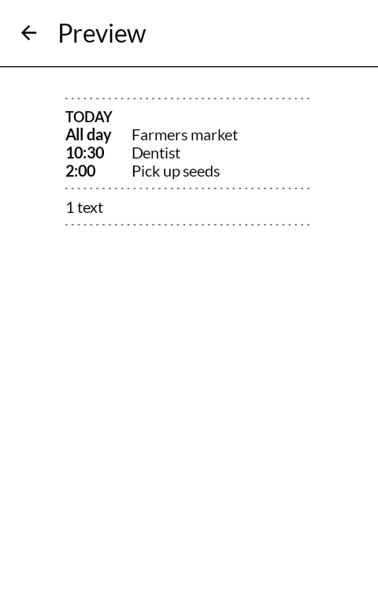
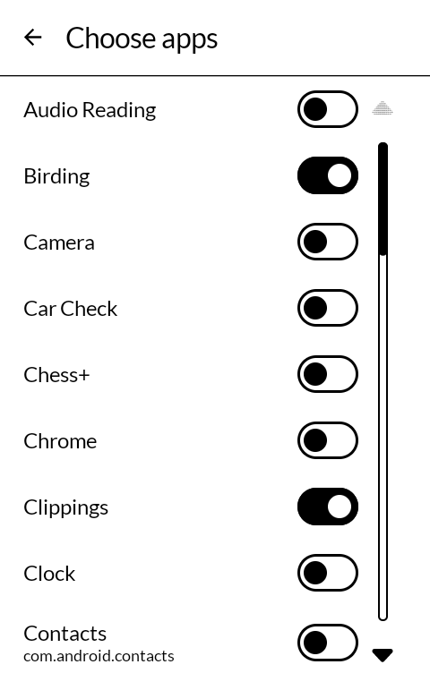

# 一目 hitome — Glance

Today's events, the weather and what is unread, on the lock screen of a Mudita Kompakt, so the
day can be seen without unlocking the phone.

*Hitome* is 一目 — one look, a glance.

| | |
|---|---|
|  |  |
|  |  |

## What it shows

A panel under the clock and date, in the lock screen's own dotted rules:

- **The emergency card**, from Field Kit, once its "Show on the lock screen" is on: the
  fields left ticked on the card, allergies and conditions in bold.
- **Today**, from [Calendar](https://github.com/wanderwildwood/koyomi): all-day events first,
  then what is still to come, with times. When there is not room for them all, it shows the
  first and how many more. Without Calendar, turn on **Today's events** in Glance and it reads
  today itself: from Mudita's own Calendar, and from the phone's other calendars if you allow
  calendar access.
- **The next dose**, from [Medicine](https://github.com/wanderwildwood/fukuyaku), once
  "Next dose on the lock screen" is on in its settings: a dose that rang and is not marked yet,
  in bold, then the next one due.
- **The weather**, from [Sky](https://github.com/wanderwildwood/soramoyo): the temperature
  now, the day's high and low, and a line when rain or snow is likely soon.
- **Pinned notes**, from [Notes](https://github.com/wanderwildwood/oboegaki): each by its title,
  and a list with how much of it is left, "Groceries · 3 to do".
- **Today's tickets**, from [Wallet](https://github.com/wanderwildwood/satsuire): the names of
  the cards good for today, a boarding pass on the day of the flight. Never the barcode.
- **What is playing**, from [Music Box](https://github.com/wanderwildwood/jimeikin) and
  [Audio Reading](https://github.com/wanderwildwood/mimidoku): the song and who sings it, or the
  book and its chapter (or the time left in a book with no chapters), and whether it is paused.
  Nothing once playback stops.
- **Unread**, from [Messaging](https://github.com/wanderwildwood/kotozute) and
  [Email](https://github.com/wanderwildwood/tayori): "2 messages · 1 email", and nothing when
  nothing is unread.
- **Other apps**, if you want them: the name of each app you choose and how many notifications
  it has waiting - "Signal 2 · Clock 1" - on up to two lines. What they say stays off the lock
  screen unless you turn on **Show what they say**; then each app gets a line with its newest
  notification, "Signal 2  Mom: see you at five", except where Android itself would hide it.
  Messaging and Email then get a line of their words too, under their counts.

Pressing a section, or an app's name, unlocks the phone and opens that app.

Glance knows nothing on its own. Each app hands it its own lines and has its own switch, in its
own settings, to stop. An app that is not installed, has nothing to say, or has its switch off
simply leaves no line. Field Kit, Medicine and Wallet also wait for a switch in Glance, under
**What it shows**, which is there once the app is installed and off until you turn it on. Other
apps are the exception: Glance counts their notifications itself, and only for the apps you
choose.

## Where it sits

It measures where the lock screen's own items end - the date, the charging line, Mudita's music
player - and starts below the lowest, each time the screen wakes. It stops above the strip Music
Box and Audio Reading draw near the foot of the screen, and above the padlock.

When there is not room for all of it, it keeps one part: today's events unless you choose the
weather or what is unread instead (**When there is not room for all of it**, in Glance).

It works with Mudita's own launcher, with inkOS, and with Katapult. When Katapult draws its own
lock-screen widgets, Glance fits around them, above or below, wherever it fits whole. If it fits
nowhere, it does not show; dragging Katapult's notifications lower makes room.

## Turning it on

1. The phone needs a screen lock, even just **Swipe**. With the lock set to None there is no lock
   screen to draw on.
2. Open Glance and press **The panel is off**: it opens Android's Accessibility settings. Turn on
   **Glance on the lock screen**.

3. **Preview** shows what the lock screen would show now, so each switch can be tried without
   locking the phone.
4. For other apps: press **Notifications are not counted**, turn on notification access for
   Glance, then **Choose apps**. Nothing is counted until you choose at least one.

An overlay above the lock screen is a window only an accessibility service is allowed to add,
which is why it needs that switch. Counting notifications needs notification access, which
Android grants to all of them; Glance counts only the ones you chose. See [PRIVACY.md](PRIVACY.md) for what it reads.

## On a Mudita Kompakt

DuraSpeed, a MediaTek service on the Kompakt, closes installed apps a few minutes after the
screen goes dark and keeps them closed until they are opened again. For Glance that means the
counts on the lock screen can stop changing. Mudita's own apps are on its allow list; this one
has to be added, once.

Kompakt's Settings has no way in to DuraSpeed: no menu entry, and no search box to look for it
in. Its own screen will not open for another app either, but its App info page will. Messaging
and Whereabouts each have a button that goes there; without either, from a computer with `adb`:

    adb shell am start -a android.settings.APPLICATION_DETAILS_SETTINGS -d package:com.mediatek.duraspeed

Then, on the phone:

1. Tap **Open** on DuraSpeed's App info page.
2. Switch **Glance** on in the list. **On means allowed** to run in the background, which is
   easy to read the wrong way round. Switching DuraSpeed off at the top works too, for every app.

## Getting it, and keeping it

Download <https://github.com/wanderwildwood/hitome/releases/latest/download/hitome.apk> and
sideload it. That address always points at the newest release, with a `.sha256` beside it.

For updates, add this repository to [Obtainium](https://github.com/ImranR98/Obtainium):

    https://github.com/wanderwildwood/hitome

## Building

```
./gradlew assembleRelease
```

A release is signed by a keystore in `signing/`, which is not in this repository. Without it the
release APK builds **unsigned** and will not install anywhere; there is no fallback key.

## For other apps

Any app can take part: a read-only provider at `<package>.glance/lines` with the columns
`heading`, `lead`, `text` and `bold`, answering only `com.wanderwildwood.hitome`. The file the
apps share is `glance/GlanceProvider.kt` in any of them. Glance reads a fixed list of apps
today; ask, and another can be added.

## Credit

The way the panel is drawn above the lock screen, and when it is taken down, follows
[Katapult](https://github.com/gezimos/Katapult) by gezimos, GPL 3.0. Built on
[MMD](https://github.com/mudita/MMD), Mudita's E Ink component library. Icons are
[Material Symbols](https://fonts.google.com/icons), Apache License 2.0.

## Licence

**GNU General Public License, version 3.** See [LICENSE](LICENSE).

Copyright © wander wildwood.
